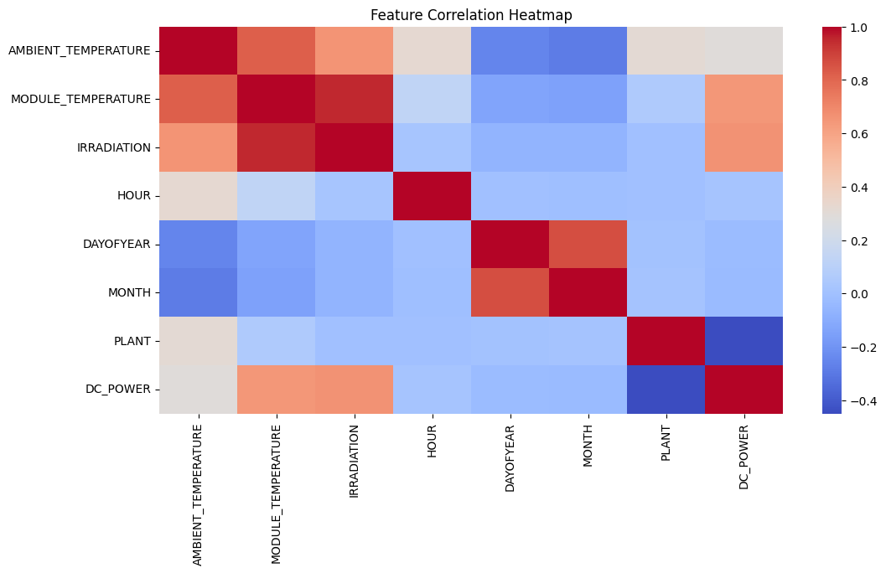
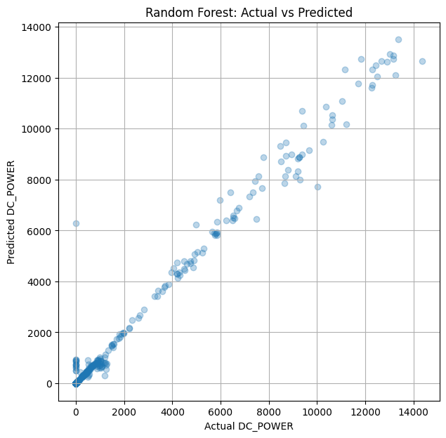

# Ryan Tran-Vu  
### AOS C111/204 Final Project  
## Predicting Solar Panel Energy Output Using Machine Learning

---

## Introduction
As the world moves towards cleaner energy sources, one popular choice the world 
has adopted is the use of solar panels. However, the energy output of these panels
are heavily influenced by factors such as weather conditions, temperature, humidity,
and wind speed. 
This project sought to train a machine learning model that is able to accurately 
predict the amount of energy a given solar power plant will generate. 

Ultimately, the model predicted **DC power output** from two solar plants in India. The model achieved very high accuracy (R² ≈ 0.987), demonstrating that solar power production can be predicted well from weather conditions.

---

## Data Description

The dataset used comes from Kaggle and consists of measurements from two solar power plants, each with:

- 22 inverters providing generation data  
- One weather sensor providing environmental data**

Each plant includes:

### Generation Data (per inverter)
- DATE_TIME  
- PLANT_ID  
- SOURCE_KEY  
- DC_POWER  
- AC_POWER  
- DAILY_YIELD  
- TOTAL_YIELD  

### Weather Sensor Data (per plant)
- DATE_TIME  
- AMBIENT_TEMPERATURE  
- MODULE_TEMPERATURE  
- IRRADIATION  

### Preprocessing Steps
- Parsed timestamps using `dayfirst=True`  
- Merged generation + weather data on `DATE_TIME` and `PLANT_ID`  
- Added engineered features: hour, month, day of year  
- Removed invalid values  
- Combined both plants into a single dataset (~136,000 rows)

---

## Methodology

Two supervised learning models were trained:

### 1. Linear Regression (Baseline)
A simple linear model used to establish baseline performance.

### 2. Random Forest Regressor
A nonlinear ensemble model able to capture complex interactions between variables.

### Features Used
- Ambient temperature  
- Module temperature  
- Irradiation  
- Hour  
- Month  
- Day of year  
- Plant ID  

The dataset was split into:
- **80% training**
- **20% testing**

Performance metrics:
- RMSE  
- MAE  
- R²
- 
In this project, I chose **DC_POWER** as the target variable instead of AC power.
DC power represents the raw power output generated directly solar panels
before they pass through the inverter. Since it is not influenced by
inverter efficiency losses or converstion fluctions, DC Power is best for measuring
solely the imapct of weather on solar panel performance.
---

## Results

### 1. Correlation Heatmap

The correlation heatmap below visualizes the relationships between all numerical features in the dataset, including temperature, irradiation, time-of-day variables, and DC power output.

A strong positive correlation is observed between **irradiation** and **DC power**. This correlation directly aligns with physical expecations, as the more sunlight hits panels, the more energy they are able to generate. Additionally, module temperature also shows moderate correlation with power output because panels heat up during periods of strong sunlight.

*Figure 1: Irradiation shows the strongest correlation with DC power, making it the most important predictor.*

---

### 2. Model Performance — Actual vs Predicted DC Power

The scatter plot below compares the Random Forest model’s predictions against the actual DC power values. Each point represents one observation from the test set.

Most points lie very close to the diagonal line, meaning the model accurately predicts power generation across nearly the entire output range. This is supported by the high R² value (≈ 0.987), low RMSE, and low MAE.

*Figure 2: Random Forest predictions closely match actual DC power values, showing strong model performance.*

---

## Discussion

The results clearly show that **solar irradiance** is the dominant factor influencing power generation, which aligns with physical expectations.  
Additionally:

- The two plants exhibited different behaviors, suggesting differences in equipment or configuration.
- Nonlinear relationships (e.g., diminishing output at extreme temperatures or irradiance levels) were captured effectively by the Random Forest model.
- Time features (hour, day, month) helped model daily and seasonal patterns in sunlight.

This demonstrates that machine learning can reliably forecast short-term solar energy output using relatively simple environmental measurements.

---

## Conclusion

This project demonstrates the effectiveness of machine learning in predicting solar panel output.  
Key takeaways:

- Random Forest achieved extremely high accuracy (R² ≈ 0.987)  
- Solar irradiance is by far the most influential variable  
- Prediction models like this can help utilities and operators with load balancing and renewable integration  
- Future improvements could include cloud cover data, humidity, AC power prediction, or long-term energy forecasts  

---

## References

1. Kaggle — *Solar Power Generation Data*:  
   https://www.kaggle.com/datasets/anikannal/solar-power-generation-data  
2. Scikit-learn documentation — https://scikit-learn.org/  
3. AOS C111/204 Course Materials  
